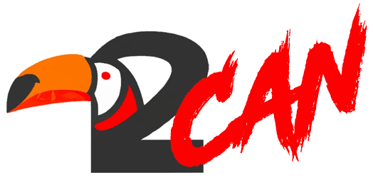

# 2CAN
April fools! (for now...)

All proof displayed of this protocol was, instead, done via RailCANon: https://github.com/Armchair-Engineering/RailCANon


PoDL (Power over Data Line) CAN Protocol Implementation




Introducing 2CAN - the cutting-edge protocol that is set to revolutionize 3D printing as we know it! Say goodbye to complicated wiring and hello to streamlined communication with just two wires.

With 2CAN, you can transmit both data and power using a unique approach that simplifies the wiring requirements for 3D printers. 2CAN achieves this by using a technique called Power over Data Line (PoDL) to enable power transmission over the same two wires used for data transfer. This technique involves using a modulated carrier signal to transfer power to a remote device, which is then demodulated and converted into usable DC power. And, just like traditional CAN protocols, 2CAN offers high reliability, robustness, and scalability, ensuring your 3D printer operates at peak performance. It supports a wide range of data rates and offers error detection and correction mechanisms to ensure data integrity.

If you're a 3D printing enthusiast or professional, you'll love 2CAN because it simplifies the wiring process, making it easier to connect and operate your 3D printer. This means you can focus on what matters most - creating stunning 3D prints without the headache of wiring complexity.

In short, 2CAN is the protocol that 3D printing has been waiting for - a simple and efficient way to transmit both data and power using just two wires. Say goodbye to wiring headaches and hello to streamlined communication with 2CAN!

# Installation
Run the following command:
```shell
cd ~
git clone https://github.com/armchair-engineering/2can_install.git
./2can_install/install.sh
```


For any questions, comments, concerns, insults, objections, or otherwise, please join the Armchair Engineering Discord:
https://discord.gg/armchairengineeringsux
